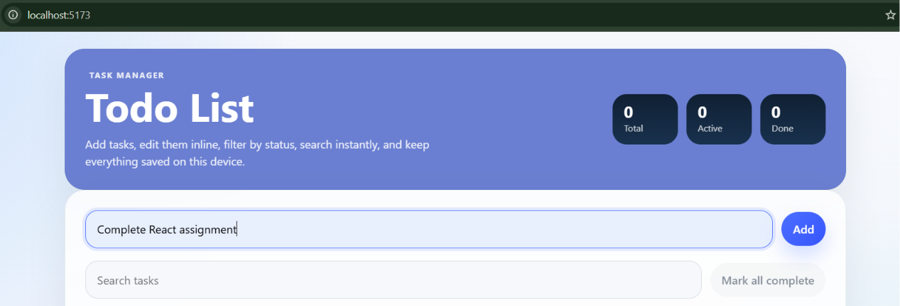
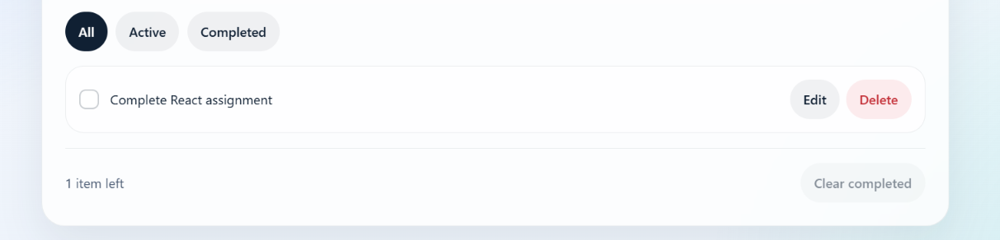
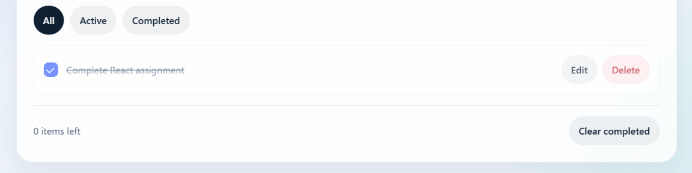
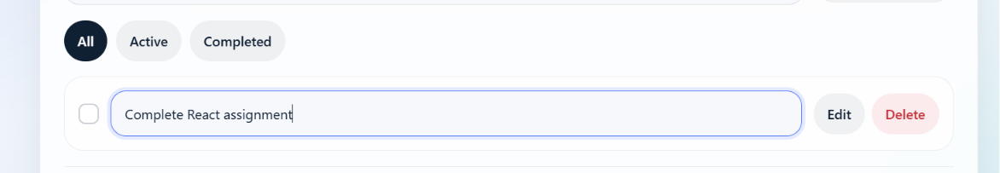
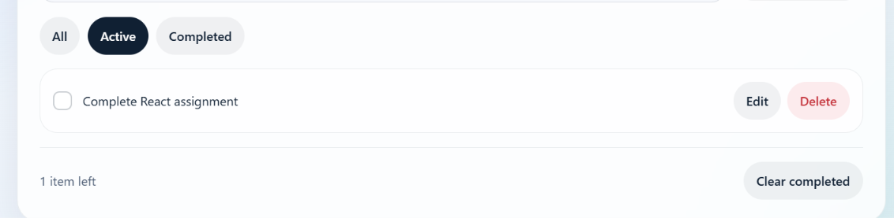
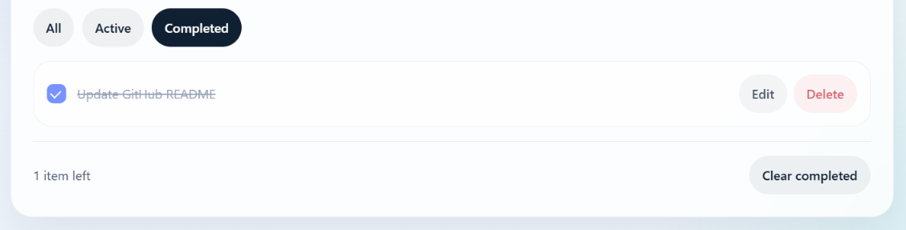
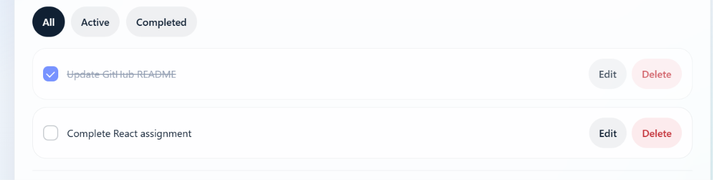
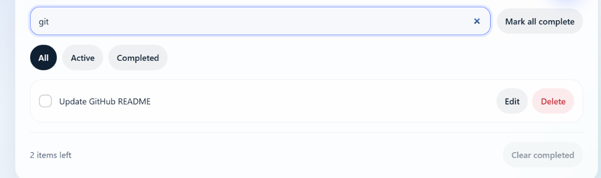

# Todo List App

This is a simple React app for managing daily tasks. You can add new tasks, mark them as done, edit them, delete them, and search through them.

## What the project does

- Add a new todo task
- Edit an existing task
- Delete a task
- Mark a task as complete or active
- Filter tasks by All, Active, and Completed
- Search tasks by text
- Save tasks in the browser using `localStorage`

## How it works

1. Type a task in the input box and click **Add**.

   
   
3. The task appears in the list below.

    

5. Use the checkbox to mark the task as done.

   
   
7. Click **Edit** to change the task text.

   
   
9. Click **Delete** to remove a task.
    
10. Use the filter buttons to show only the tasks you want.
    
    
    
    
    
12. Use the search box to find a task quickly.

    
  
14. The app saves your tasks in the browser, so they stay after refresh.

## Demo


## Project files

- `src/App.jsx` - main todo app logic and UI
- `src/styles.css` - app styling
- `src/main.jsx` - app entry file

## How to run

Install packages first:

```bash
npm install
```

Start the app in development mode:

```bash
npm run dev
```

Create a production build:

```bash
npm run build
```

Preview the production build:

```bash
npm run preview
```

## Notes

- This is a web app made with React and Vite.
- Your tasks are stored only in this browser.
